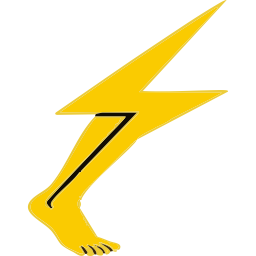

#  SciKick 

An AI research companion — Chrome extension + local server. Brainstorm ideas, discuss your scientific writing, analyze text-based data, and navigate peer review. Works with any scientific field.

[](https://ko-fi.com/scikick)

## What it does

- **Chat with your papers** — Discuss manuscripts, figure captions, text-based data, and reviewer feedback
- **Google Drive integration** — Load papers, figures, and documents directly from Drive
- **Cross-computer resume** — Session state saved to your Drive folder; pick up where you left off
- **Runs locally** — No hosting costs, your data stays on your machine
- **Streaming responses** — Real-time AI chat with streaming

### 📹 Feature Demo Video

<p align="center">
  <a href="https://www.youtube.com/watch?v=F5u4WGnunSs">
    
  </a>
</p>

### Limitations

- **Figures and images are not automatically analyzed** — SciKick extracts text from your files, not images. The AI can discuss figures via their captions and surrounding text, but cannot "see" graphs, microscopy images, or charts embedded in your documents.
- **Manual workaround** — You can paste screenshots of figures directly into the chat for visual analysis. This works with multi-modal LLMs like **Claude** (Sonnet 4, Opus 4, Fable 5) and **GPT-4o**.
- **Future plans** — If enough people ask for it, we'll add automatic figure extraction and parsing from PDFs and DOCX files. Let us know!

## Side Panel Overview

The top bar has five buttons (left to right):

| Button | Name | What it does |
|--------|------|--------------|
| **ℹ** | Info | View loaded data — project file tree, scraped articles, session state, memory stats. You can delete individual scraped articles or unload the entire project from here. |
| **—** | Clear Chat | Wipes the chat history shown on screen. Your project context and session memory are unaffected — the AI still remembers everything. |
| **🌙** | Theme | Toggle between dark theme (default) and light theme. Your preference is saved and persists across restarts. |
| **⚙** | Settings | Configure your LLM provider, API key, model, and custom base URL. Changes take effect immediately and are saved for the next restart. |
| **⟳** | Restart | Restarts your session — wipes the chat and re-shows the onboarding options ("What would you like to work on today?"). Server state is cleared but project files stay loaded. |

## Architecture

```
Chrome Extension (side panel) ↔ Local Server (localhost:8742) ↔ Google Drive API + LLM API
```

- **Server**: Python/FastAPI
- **Extension**: Chrome Manifest V3 side panel
- **Memory**: `.scikick_memory.json` stored in your Google Drive project folder
- **AI**: Multi-provider — Anthropic Claude, DeepSeek, OpenAI, or any OpenAI-compatible API

---

## Quick Start

### Prerequisites

- **Python 3.10+**
- **Chrome** (or Chromium-based browser: Edge, Brave, Arc)
- **LLM API key** from one of the supported providers (see below)
- **Google account** (any Gmail) — for Google Drive access

### Supported LLM Providers

| Provider | Get API key at | Default model |
|----------|---------------|---------------|
| **Anthropic (Claude)** | [console.anthropic.com](https://console.anthropic.com/) | `claude-sonnet-4-6` |
| **DeepSeek** | [platform.deepseek.com](https://platform.deepseek.com/) | `deepseek-chat` |
| **Zhipu AI (GLM)** | [open.bigmodel.cn](https://open.bigmodel.cn/) | `glm-4-plus` |
| **OpenAI (GPT-4o)** | [platform.openai.com](https://platform.openai.com/) | `gpt-4o` |
| **Custom** (Ollama, Groq, Together, etc.) | Your provider | Any |

> 💡 Want support for a specific AI provider? Open an issue or start a discussion on GitHub — we can usually add it quickly.

### 1. Get the code

```bash
git clone https://github.com/JHCCoder/scikick.git
cd scikick
```

Or copy the folder from a USB stick / shared drive — no git required.

### 2. Run the setup wizard

```bash
./start.sh --setup
```

The wizard walks you through:
- Choosing your LLM provider and entering your API key
- Setting up Google Drive access (auto-opens each Google Cloud Console page for you, scans your Downloads for the credentials file, validates everything)

**This takes ~5 minutes** — most of that is clicking buttons in Google Cloud Console tabs that the wizard opens for you.

### 3. Start the server

The setup wizard asks if you want the server to start automatically on login (recommended). If you said yes, you're done — just click the extension.

Otherwise, start it manually:

```bash
./start.sh
```

Or install the background service later:

```bash
./start.sh --install-service
```

You should see:
```
━━━━━━━━━━━━━━━━━━━━━━━━━━━━━━━━━━━━━━━
  Server:  http://localhost:8742
  Health:  http://localhost:8742/health
  API docs: http://localhost:8742/docs
━━━━━━━━━━━━━━━━━━━━━━━━━━━━━━━━━━━━━━━
```

### 4. Load the Chrome extension

```bash
./install-extension.sh
```

This auto-detects your browser, opens the extensions page, and copies the extension folder path to your clipboard.

Or manually:
1. Go to `chrome://extensions/`
2. Enable **Developer mode** (toggle in top right)
3. Click **Load unpacked**
4. Select the `extension/` folder from this project

### 5. Authenticate with Google (first time only)

Visit [http://localhost:8742/drive/auth/url](http://localhost:8742/drive/auth/url) in your browser, sign in with your Google account, and grant the requested permissions.

### 6. Load a project and start chatting

1. Click the SciKick icon 📄 in your Chrome toolbar to open the side panel
2. Paste your Google Drive folder URL (or ID):
   ```
   https://drive.google.com/drive/folders/1abc123...
   ```
3. Click **Load Project**
4. Pick your interaction type (Brainstorming, Paper Discussion, etc.)

Ask questions like:
- "What are Reviewer 2's main concerns?"
- "Help me draft a response about Figure 3"
- "Does my Methods section address the concern about sample size?"
- "Compare what Reviewer 1 and Reviewer 2 said about the statistical analysis"
- "Help me rephrase this paragraph to be clearer"

---

## Google Drive Setup (re-run anytime)

```bash
./start.sh --setup
```

If LLM is already configured, the wizard skips straight to Google Drive setup.

### What the wizard does

The setup wizard treats Google Cloud Console as part of the app — it auto-opens each page you need and tells you exactly what to click:

| Step | What it opens | What you do |
|------|--------------|-------------|
| 1 | Project creation page | Click "Create" |
| 2 | Drive API page | Click "Enable" |
| 3 | Sheets API page | Click "Enable" |
| 4 | OAuth consent screen | Fill in app name, add scopes, add test user |
| 5 | Credentials page | Create OAuth client ID → Download JSON |
| 6 | (Local) | Wizard auto-finds the JSON in ~/Downloads, validates it, installs it |

---

## Project Folder Structure

Your Google Drive folder should look like this:

```
/My Paper Revision/
├── manuscript.pdf               # Your paper (PDF, DOCX, or Google Doc)
├── figures/
│   ├── fig1_methodology.png
│   ├── fig2_main_results.png
│   └── fig3_supplementary.png
├── supplementary/
│   ├── supp_table1.xlsx
│   └── supp_methods.pdf
├── reviewer_comments/            # Reviewer feedback
│   ├── reviewer_1.pdf
│   ├── reviewer_2.pdf
│   └── combined_comments.docx
├── response_letter.md            # Your draft response (optional)
└── .scikick_memory.json  # Auto-created session state
```

You can also use a **Google Sheet** for reviewer comments — the system auto-detects columns like "Reviewer", "Comment", "Severity", and "Response".

---

## Sharing with Labmates

Each person needs their own setup — SciKick runs locally and uses personal API keys and Google credentials.

### For a labmate setting up from scratch

1. **Get the code**: `git clone https://github.com/JHCCoder/scikick.git` (or copy from a USB stick)
2. **Get an LLM API key**: Sign up at [DeepSeek](https://platform.deepseek.com/) (or Anthropic, OpenAI, etc.)
3. **Run the setup wizard**: `./start.sh --setup` — it guides you through Google Cloud setup and LLM config
4. **Start the server**: `./start.sh`
5. **Load the extension**: Run `./install-extension.sh` or follow the manual steps
6. **Authenticate**: Visit `http://localhost:8742/drive/auth/url`
7. **Load a project**: Paste a Google Drive folder URL and click Load Project

### Using the same Google Drive folder (collaborating)

If you want to work on the same paper together:
- Share the Google Drive folder with your labmate (via Google Drive's Share button)
- Each person uses their **own** Google OAuth credentials and LLM API key
- The `.scikick_memory.json` file syncs via Drive — you'll see each other's chat context
- Each person's LLM responses are independent (your API keys are separate)

### Cross-computer resume (same person, different machine)

Same as above — clone the code, run `./start.sh --setup` on the new machine (you'll need your Google credentials JSON again). Paste the same Drive folder ID and the server restores your session.

### Security

- **Never commit `google_credentials.json`, `google_token.json`, or `.env`** — they contain secrets
- `.gitignore` already excludes these
- Each person should use their own Google Cloud OAuth client and API key
- Local data (`~/.scikick/`) contains tokens — don't share that folder

---

## Configuration

### LLM Provider

| Variable | Default | Description |
|----------|---------|-------------|
| `LLM_PROVIDER` | `anthropic` | Provider: `anthropic`, `deepseek`, `openai`, or `custom` |
| `LLM_API_KEY` | (required) | Your API key |
| `LLM_MODEL` | (provider default) | Model name override |
| `LLM_BASE_URL` | (provider default) | Base URL for custom providers |

These are saved to `.env` by the setup wizard.

### Server

| Variable | Default | Description |
|----------|---------|-------------|
| `REVISION_HOST` | `127.0.0.1` | Server bind address |
| `REVISION_PORT` | `8742` | Server port |
| `GOOGLE_CREDENTIALS` | `~/.scikick/google_credentials.json` | Path to Google OAuth credentials |

### Switching providers later

Run `./start.sh --setup` again, or edit `.env` directly and restart the server.

---

## Commands

| Command | What it does |
|---------|-------------|
| `./start.sh` | Start the server |
| `./start.sh --setup` | Setup wizard (LLM + Google Drive + background service) |
| `./start.sh --install-service` | Install as background service (auto-start on login) |
| `./start.sh --uninstall-service` | Remove background service |
| `./start.sh --install` | Install dependencies then start |
| `./start.sh --help` | Show help |
| `./install-extension.sh` | Browser-guided extension loading |

---

## API Endpoints

| Endpoint | Method | Description |
|----------|--------|-------------|
| `/health` | GET | Server health check |
| `/drive/auth/url` | GET | Get Google OAuth URL |
| `/drive/auth/status` | GET | Check auth status |
| `/drive/folder/{id}/resume` | GET | Load project + restore memory |
| `/drive/folder/{id}/files` | GET | List files in folder |
| `/drive/file/{id}/download` | GET | Download a file |
| `/chat/send` | POST | Send message (SSE streaming) |
| `/chat/send-sync` | POST | Send message (synchronous) |
| `/chat/providers` | GET | List available/configured LLM providers |
| `/chat/context` | GET | Get current project context |
| `/memory/init` | POST | Initialise new memory |
| `/memory/status` | GET | Get memory status |
| `/memory/update` | POST | Update after chat turn |
| `/memory/decision` | POST | Record a decision |
| `/memory/comment/{id}` | PUT | Update a comment's state |

---

## Troubleshooting

**Server won't start — "No LLM API key found"**
Run `./start.sh --setup` to configure your API key, or create a `.env` file with `LLM_API_KEY=your-key-here`.

**"Google credentials not found" when starting**
Run `./start.sh --setup` to run the guided Google Drive setup wizard.

**Extension side panel shows "Server disconnected"**
Make sure the server is running (`./start.sh`). The status dot in the top bar should be green.

**Google auth page says "Error: redirect_uri_mismatch"**
Make sure you created an OAuth client ID of type "Desktop application" (not "Web application"). Re-run `./start.sh --setup` to redo the credentials.

**"This app isn't verified" warning during Google sign-in**
This is normal for a local app. Click "Advanced" → "Go to SciKick (unsafe)" to continue. You added yourself as a test user during setup, so this works.

---

## Tips

- **Use a Google Sheet for reviewer comments** — easier to track status and add draft responses
- **Name figures clearly** — the AI reads captions and surrounding text, so `fig2_main_results.png` gives more context than `IMG_4829.png`
- **Keep the server running** — it's lightweight and stateless between requests
- **The memory file is human-readable** — you can inspect or edit `.scikick_memory.json` in your Drive folder

## Support

If SciKick saves you time on your research, [buy me a coffee on Ko-fi](https://ko-fi.com/scikick) ☕. It helps cover development time and keeps the tool free for everyone.

## License

MIT
